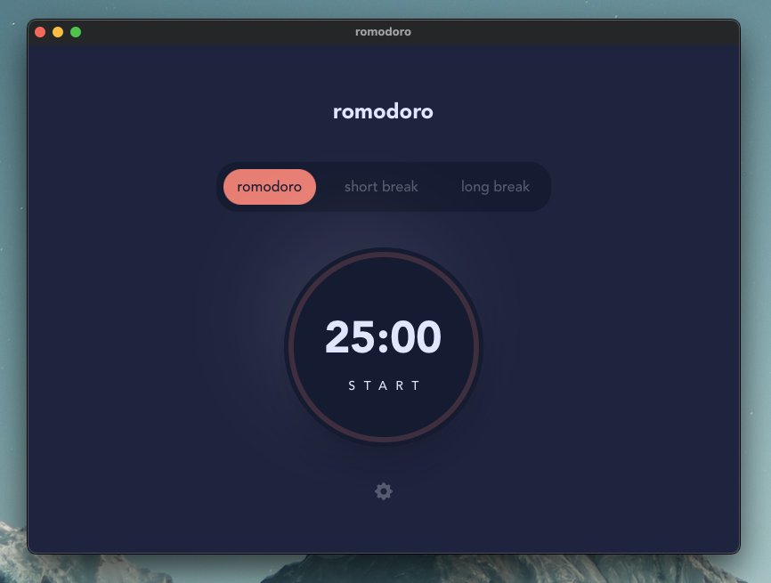
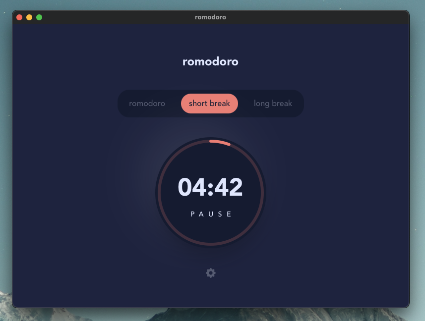
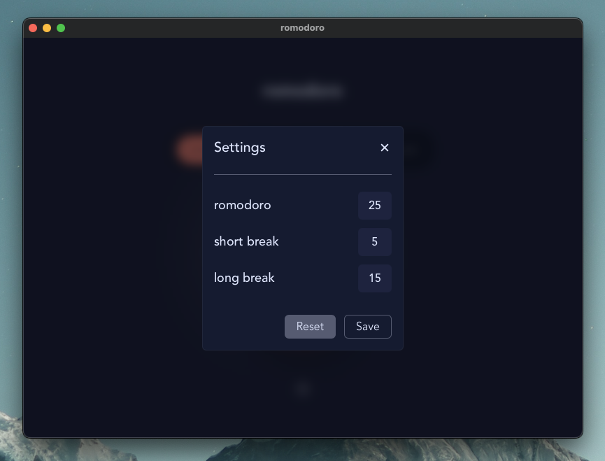

# romodoro

romodoro is a simple pomodoro app build with [Tauri](https://tauri.app/), [Next.js](https://nextjs.org/), [TypeScript](https://www.typescriptlang.org/) and [Rust](https://www.rust-lang.org/).

## Screenshots

## Design

[Frontendmentor.io](https://www.frontendmentor.io/challenges/pomodoro-app-KBFnycJ6G)
